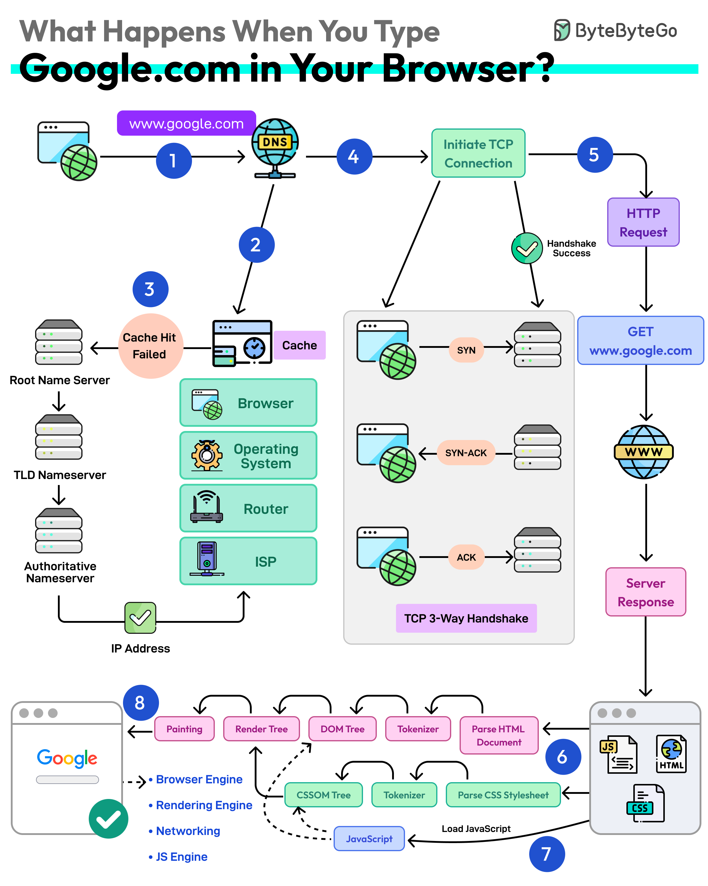

# How the Internet Works

When a user visits a website, several processes happen in the background between the browser and a web server.

## Step 1 – Entering a URL

The user enters a website address into a browser such as Chrome or Firefox.

The browser then needs to find the server that hosts the website.

## Step 2 – DNS Lookup

The domain name is translated into an IP address using the Domain Name System (DNS).

## Step 3 – HTTP Request

The browser sends an HTTP request to the web server asking for the website.

## Step 4 – Server Response

The server responds with the files required to display the website.

These typically include:

- HTML
- CSS
- JavaScript
- images

## Step 5 – Rendering the Website

The browser interprets these files and renders the webpage for the user.

---

[Back to Home](index)
